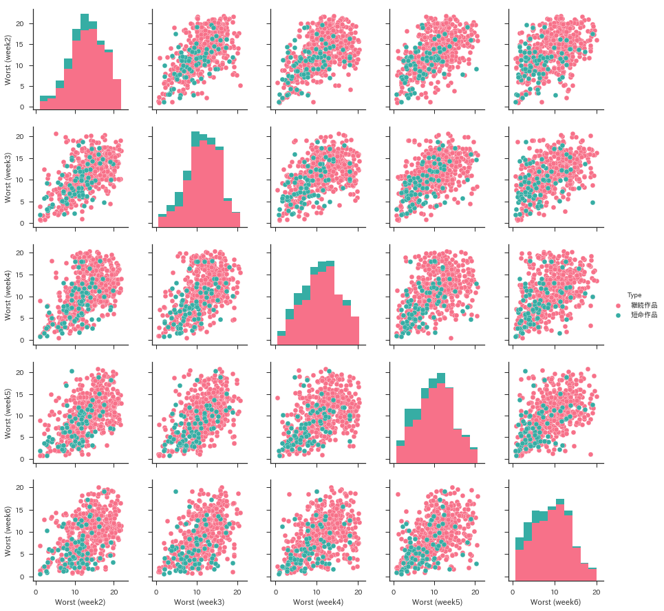
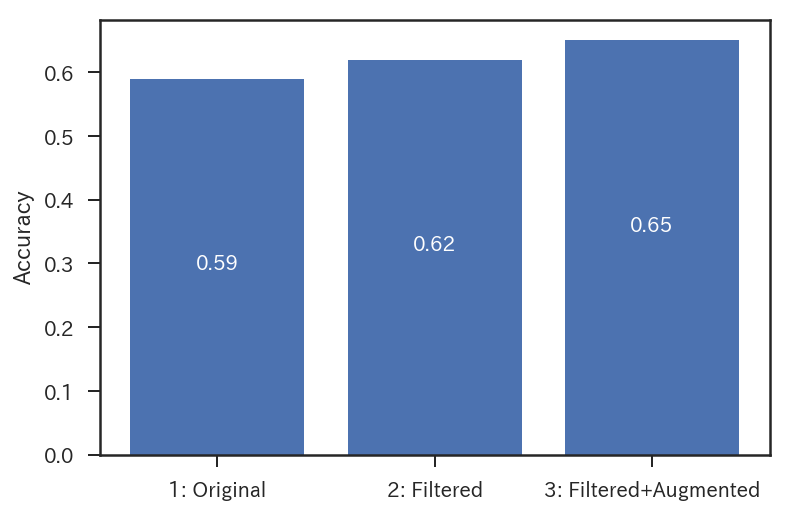

# predicting-comic-end
This repository includes python codes and jupyter notebooks to predict the end of comic serialized in [weekly shonen jump](https://www.shonenjump.com).

## Introduction

[Weekly shonen jump](https://www.shonenjump.com) is one of the most popular *manga* magazin in Japan. 
[Dragon Ball](https://en.wikipedia.org/wiki/Dragon_Ball), [Slum Dunk](https://en.wikipedia.org/wiki/Slam_Dunk_(manga)), [Naruto](https://en.wikipedia.org/wiki/Naruto), [Bleach](https://en.wikipedia.org/wiki/Bleach_(manga)), and so on, were serialized in this weekly magazine. 
[One Piece](https://en.wikipedia.org/wiki/One_Piece), which was awarded a *Guiness World Record* for the most copies published for the same comic book series by a single author, is being serialized, too.

Empirically, the order of *manga* titles in weekly shonen jump seem to be related to their popularity: the more popular a *manga* is, the former it is in the magazine.
Unpopular *manga*s can be closed even if they have been serialized for less than 10 weeks. 
Our goal is to predict the end of comic serialized in weekly shonen jump from the order of comics.
We obtain the indexes of the magazine for about 46 years from [Media Art Database](https://mediaarts-db.bunka.go.jp/?utf8=%E2%9C%93&locale=en).
We build a neural network with tensorflow.

## Environment

## Obtain data 

Please refer to the jupyter notebook below:

```bash
jupyter notebook 0_obtain_comic_data_j.ipynb

```

English version of the notebook is now in preparation...

## Analysis

Please refer to the jupyter notebook below:

```bash
jupyter notebook 1_analyze_comic_data_j.ipynb

```



English version of the notebook is now in preparation...

## Train and test (neural network) 

Please refer to the jupyter notebook below:

```bash
jupyter notebook 2_train_and_test_neural_network_j.ipynb

```



English version of the notebook is now in preparation...


## License
MIT
